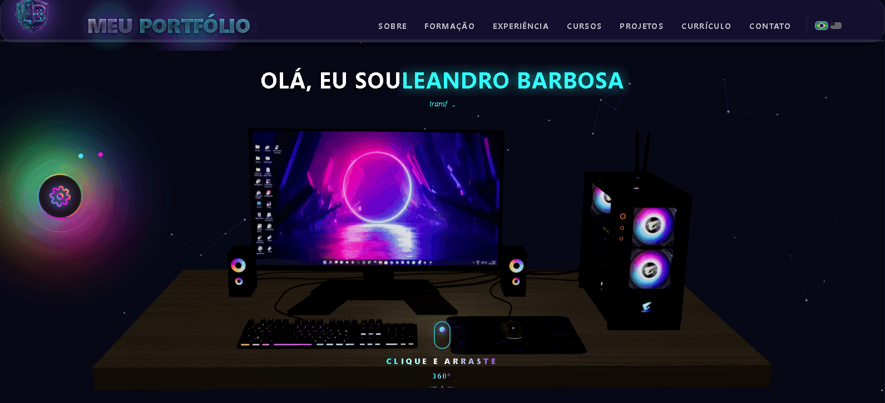

# 🚀 Portfólio 3D - Leandro Saturnino Barbosa

<div align="center">



*Portfólio interativo e imersivo em 3D desenvolvido com React, Three.js e Tailwind CSS*

[](https://reactjs.org/)
[](https://www.typescriptlang.org/)
[](https://threejs.org/)
[](https://tailwindcss.com/)
[](https://vitejs.dev/)
[](https://www.framer.com/motion/)

</div>

---

## 📖 Sobre

Portfólio profissional interativo e imersivo em 3D, desenvolvido com as tecnologias mais modernas do ecossistema web. Combina design cyberpunk/neon, animações fluidas e elementos 3D interativos para criar uma experiência única de navegação e showcase de projetos e habilidades técnicas.

### ✨ Destaques

- 🎨 **Design Imersivo** - Tema dark com elementos neon e animações suaves
- 🌐 **3D Interativo** - Background dinâmico com Three.js e partículas animadas
- 📱 **100% Responsivo** - Otimizado para desktop, tablet e mobile
- ⚡ **Alta Performance** - Lazy loading, code splitting e otimizações avançadas
- 🔒 **Seguro por Padrão** - CSP, sanitização e validação de dados
- 📱 **PWA Ready** - Instalável e funcional offline
- 🔍 **SEO Otimizado** - Meta tags, Open Graph, Twitter Cards e Schema.org

---

## 🛠️ Stack Técnica

### Core
| Tecnologia | Versão | Descrição |
|------------|--------|-----------|
| **React** | 18.3.1 | Biblioteca para interfaces modernas |
| **TypeScript** | 5.2.2 | Tipagem estática e segurança |
| **Vite** | 6.2.5 | Build tool ultrarrápida com HMR |
| **Tailwind CSS** | 4.2.2 | Framework utility-first |

### 3D e Animações
| Tecnologia | Versão | Descrição |
|------------|--------|-----------|
| **Three.js** | 0.160.0 | Biblioteca 3D para WebGL |
| **@react-three/fiber** | 8.17.8 | Renderizador React para Three.js |
| **@react-three/drei** | 9.112.0 | Utilitários e helpers para R3F |
| **Framer Motion** | 11.11.11 | Animações fluidas e performáticas |

### Roteamento e Estado
| Tecnologia | Versão | Descrição |
|------------|--------|-----------|
| **React Router DOM** | 6.22.1 | Roteamento SPA |
| **Zod** | 4.3.6 | Validação de schemas |

### Internacionalização
| Tecnologia | Versão | Descrição |
|------------|--------|-----------|
| **i18next** | 26.0.1 | Framework de i18n |
| **react-i18next** | 17.0.1 | Integração React |
| **i18next-browser-languagedetector** | 8.2.1 | Detecção automática de idioma |

### UI Components
| Tecnologia | Versão | Descrição |
|------------|--------|-----------|
| **react-icons** | 5.6.0 | Biblioteca de ícones |
| **react-parallax-tilt** | 1.7.212 | Efeito 3D tilt |
| **react-vertical-timeline-component** | 3.6.0 | Timeline vertical |
| **react-helmet-async** | 3.0.0 | Gerenciamento de head |

### Email e Formulários
| Tecnologia | Versão | Descrição |
|------------|--------|-----------|
| **nodemailer** | 8.0.4 | Envio de emails |

### Build e Otimização
| Ferramenta | Versão | Descrição |
|------------|--------|-----------|
| **@vitejs/plugin-react** | 4.3.4 | Plugin React para Vite |
| **@tailwindcss/vite** | 4.2.2 | Plugin Tailwind para Vite |
| **vite-plugin-image-optimizer** | 2.0.3 | Otimização de imagens |
| **vite-plugin-compression** | - | Compressão Brotli/Gzip |
| **sharp** | 0.34.5 | Processamento de imagens |
| **svgo** | 4.0.1 | Otimização de SVGs |

### Qualidade de Código
| Ferramenta | Versão | Descrição |
|------------|--------|-----------|
| **@biomejs/biome** | 2.4.9 | Linter e formatter |
| **typescript** | 5.2.2 | Compilador TS |
| **jest** | 30.3.0 | Framework de testes |

---

## 📦 Como Executar Localmente

### Pré-requisitos

- **Node.js** 18+ ([Download](https://nodejs.org/))
- **npm** ou **yarn** (já incluso com Node.js)

### Instalação Rápida

```bash
# 1. Clone o repositório
git clone https://github.com/lelebrr/Meu_Portifolio.git
cd Meu_Portifolio

# 2. Instale as dependências
npm install

# 3. Execute em modo desenvolvimento
npm run dev
```

O projeto estará disponível em `http://localhost:5173`

### Scripts Disponíveis

| Comando | Descrição |
|---------|-----------|
| `npm run dev` | Inicia servidor de desenvolvimento com HMR |
| `npm run build` | Gera build de produção (com verificação TypeScript) |
| `npm run build:ci` | Build para CI/CD (igual ao build) |
| `npm run preview` | Preview local do build gerado |
| `npm run test` | Executa testes unitários |
| `npm run optimize:3d` | Otimiza modelos 3D |
| `npm run optimize:textures` | Otimiza texturas |

---

## 🏗️ Build de Produção

```bash
# Gerar build otimizado
npm run build

# O build será gerado na pasta dist/
# Para preview local:
npm run preview
```

### Otimizações Aplicadas

- ✅ **TypeScript** - Verificação de tipos antes do build
- ✅ **Code Splitting** - Separação automática de chunks
- ✅ **Tree Shaking** - Remoção de código não utilizado
- ✅ **Minificação** - Terser com otimizações avançadas
- ✅ **Compressão** - Brotli e Gzip automáticos
- ✅ **Asset Hashing** - Cache busting com hash nos arquivos
- ✅ **Image Optimization** - Otimização automática de imagens
- ✅ **Chunk Naming** - Nomenclatura organizada por categoria

**Chunks Gerados:**
- `vendor-three` - Three.js e relacionados
- `vendor-motion` - Framer Motion
- `vendor-core` - React e dependências core
- `vendor-i18n` - i18next e relacionados
- `vendor-router` - React Router
- `vendor-ui` - Componentes de UI
- `vendor-utils` - Utilitários (Zod, etc.)
- `vendor-icons` - Ícones

---

## ✨ Features Principais

### 🎨 Design e Experiência

- **Background 3D Interativo** - Partículas animadas com Three.js que respondem à interação do usuário
- **Animações Suaves** - Framer Motion com parallax effects e transições elegantes
- **Layout Responsivo** - Mobile-first, otimizado para todos dispositivos
- **Tema Dark** - Paleta cyberpunk/neon com alto contraste
- **Performance Otimizada** - Lazy loading de componentes e imagens
- **Acessibilidade** - ARIA labels, navegação por teclado, contraste WCAG

### 📄 Seções do Portfólio

1. **Hero** - Introdução impactante com call-to-action e elemento 3D interativo
2. **Sobre** - Biografia profissional, stack técnica e estatísticas
3. **Projetos** - Showcase de trabalhos com cards interativos e filtros
4. **Formação** - Timeline vertical de certificados e cursos
5. **Certificados** - Galeria de documentos acadêmicos e profissionais
6. **Contato** - Formulário com integração EmailJS e validação Zod

### 🔧 Funcionalidades Técnicas

#### PWA (Progressive Web App)
- ✅ Manifest configurado com ícones otimizados
- ✅ Service Worker para cache de assets
- ✅ Funcionamento offline
- ✅ Display standalone (app-like)
- ✅ Install prompt nativo

#### SEO
- ✅ Meta tags completas (Open Graph, Twitter Cards)
- ✅ Schema.org markup para rich snippets
- ✅ Sitemap XML automático
- ✅ Robots.txt configurado
- ✅ Canonical URLs
- ✅ Structured Data (JSON-LD)

#### Segurança
- ✅ **CSP (Content Security Policy)** configurada no `index.html`
- ✅ Sanitização de inputs nos formulários
- ✅ Validação com Zod em todos os dados
- ✅ HTTPS only em produção
- ✅ Headers de segurança configurados
- ✅ Sem XSS vulnerabilities

#### Performance
- ✅ Lazy loading de componentes pesados
- ✅ Code splitting automático
- ✅ Image optimization (WebP, AVIF)
- ✅ Preload de recursos críticos
- ✅ Font display swap
- ✅ Gzip/Brotli compression

#### Internacionalização
- ✅ Suporte a múltiplos idiomas (PT/EN)
- ✅ Detecção automática de idioma
- ✅ Persistência da preferência
- ✅ Traduções completas

---

## 📁 Estrutura de Pastas

```
Meu_Portifolio/
├── public/                         # Arquivos estáticos
│   ├── assets/
│   │   ├── documents/             # PDFs de certificados
│   │   ├── icons/                 # Ícones PWA
│   │   ├── images/                # Imagens do site
│   │   │   ├── about-image.jpg
│   │   │   ├── eu-hM19CCeb.jpg
│   │   │   ├── logo.png
│   │   │   ├── preview.png
│   │   │   └── ...
│   │   └── ...
│   ├── certificados/              # PDFs de certificados
│   ├── formacao/                  # Imagens de formação
│   ├── desktop_pc/                # Texturas 3D (WebP)
│   ├── manifest.json              # PWA manifest
│   ├── robots.txt                 # SEO robots
│   ├── sitemap.xml                # Sitemap
│   ├── sw.js                      # Service Worker
│   └── index.html                 # HTML template
├── src/
│   ├── components/                # Componentes React
│   │   ├── atoms/                 # Componentes atômicos
│   │   │   └── PCGamerStatic.tsx
│   │   ├── canvas/                # Componentes 3D (Three.js)
│   │   │   ├── BackgroundManager.tsx
│   │   │   ├── ThreeExperience.tsx
│   │   │   └── ...
│   │   ├── layout/                # Layout components
│   │   │   └── Navbar.tsx
│   │   ├── sections/              # Seções da página
│   │   │   ├── Hero.tsx
│   │   │   ├── About.tsx
│   │   │   ├── Projects.tsx
│   │   │   ├── Education.tsx
│   │   │   ├── Contact.tsx
│   │   │   └── ...
│   │   └── ui/                    # Componentes de interface
│   ├── contexts/                  # React Contexts
│   │   ├── ThemeContext.tsx
│   │   ├── LanguageContext.tsx
│   │   └── ...
│   ├── data/                      # Dados estáticos
│   │   ├── projects.ts
│   │   ├── education.ts
│   │   ├── companies.ts
│   │   └── ...
│   ├── hooks/                     # Custom hooks
│   │   ├── useIntersectionObserver.ts
│   │   ├── useLocalStorage.ts
│   │   └── ...
│   ├── i18n/                      # Internacionalização
│   │   ├── translations/
│   │   │   ├── en.json
│   │   │   └── pt.json
│   │   └── index.ts
│   ├── pages/                     # Páginas (se houver)
│   ├── types/                     # Definições TypeScript
│   │   ├── index.ts
│   │   ├── project.ts
│   │   └── ...
│   ├── utils/                     # Funções utilitárias
│   │   ├── formatters.ts
│   │   ├── validators.ts
│   │   └── ...
│   ├── assets/                    # Assets importados
│   ├── constants/                 # Constantes e configurações
│   ├── App.tsx                    # Componente principal
│   ├── main.tsx                   # Entry point
│   ├── globals.css                # Estilos globais
│   └── critical.css               # CSS crítico
├── scripts/                       # Scripts de build/otimização
│   ├── optimize-3d-assets.js
│   ├── optimize-textures.js
│   ├── add-icons-to-cursos.js
│   └── ...
├── __tests__/                     # Testes
├── index.html                     # HTML template
├── package.json                   # Dependências
├── package-lock.json              # Lock file
├── vite.config.js                 # Configuração Vite
├── tsconfig.json                  # Configuração TypeScript
├── tsconfig.node.json             # Config TS para Node
├── postcss.config.cjs             # Configuração PostCSS
├── tailwind.config.js             # Configuração Tailwind
├── biome.json                     # Configuração Biome
├── .vite/                         # Cache do Vite
├── .vscode/                       # Configurações VS Code
├── README.md                      # Este arquivo
├── README_SECURITY.md             # Documento de segurança
├── LICENSE                        # Licença MIT
└── .gitignore                     # Arquivos ignorados
```

---

## 🔒 Segurança

Este projeto implementa múltiplas camadas de segurança:

### Content Security Policy (CSP)
- Diretivas restritivas configuradas no `index.html`
- Proteção contra XSS e injeção de código
- Whitelist de sources confiáveis

### Validação de Dados
- **Zod** para schema validation em formulários
- Sanitização de todos os inputs do usuário
- Tipagem TypeScript em todo o código

### Headers de Segurança
- HTTPS only em produção
- HSTS (HTTP Strict Transport Security)
- X-Frame-Options: DENY
- X-Content-Type-Options: nosniff
- Referrer-Policy configurado

### Boas Práticas
- Sem `eval()` ou `innerHTML` inseguros
- Dependências atualizadas e auditadas
- Secrets nunca commitados (.env no .gitignore)

Para detalhes completos, consulte [README_SECURITY.md](README_SECURITY.md).

---

## 🌐 Deploy

### Pré-requisitos para Produção

1. Configure variáveis de ambiente (se necessário)
2. Execute o build: `npm run build`
3. Teste localmente: `npm run preview`

### Plataformas Suportadas

#### Vercel / Netlify
```bash
npm run build
# Faça upload da pasta dist/
```

**Configuração Vercel:**
- Framework Preset: Vite
- Build Command: `npm run build`
- Output Directory: `dist`
- Install Command: `npm install`

#### GitHub Pages
```bash
npm run build
# Mova os arquivos de dist/ para a branch gh-pages
```

**Configuração:**
```json
// package.json - adicione:
"homepage": "https://lelebrr.github.io/Meu_Portifolio"
```

#### Docker
```dockerfile
# Multi-stage build para otimização
FROM node:18-alpine AS builder
WORKDIR /app

# Copy dependencies
COPY package*.json ./
RUN npm ci --only=production

# Copy source
COPY . .

# Build
RUN npm run build

# Production image
FROM nginx:alpine
COPY --from=builder /app/dist /usr/share/nginx/html

# Copy nginx config (optional)
# COPY nginx.conf /etc/nginx/conf.d/default.conf

EXPOSE 80
CMD ["nginx", "-g", "daemon off;"]
```

**Build e execução:**
```bash
docker build -t portfolio .
docker run -p 80:80 portfolio
```

#### Outras Plataformas
- **Railway** - Deploy automático do repositório
- **Render** - Static Site com build command
- **Cloudflare Pages** - Suporte nativo a Vite
- **AWS S3 + CloudFront** - Host estático

---

## 🧪 Testes

```bash
# Executar testes
npm run test

# Com coverage
npm run test -- --coverage

# Modo watch
npm run test -- --watch
```

---

## 🔧 Configuração

### Variáveis de Ambiente

Crie um arquivo `.env` na raiz (opcional, para formulário de contato):

```env
# EmailJS Configuration (para formulário de contato)
VITE_EMAILJS_SERVICE_ID=your_service_id
VITE_EMAILJS_TEMPLATE_ID=your_template_id
VITE_EMAILJS_PUBLIC_KEY=your_public_key
```

### Personalização

#### Cores (Tailwind)
Edite `tailwind.config.js` para customizar a paleta:

```js
theme: {
  extend: {
    colors: {
      primary: {
        50: '#f0f9ff',
        // ...
      }
    }
  }
}
```

#### 3D Scene
Ajuste `src/components/canvas/ThreeExperience.tsx` para modificar:
- Partículas
- Iluminação
- Geometrias
- Interações

---

## 📊 Performance

### Métricas Esperadas (Lighthouse)

| Métrica | Score | Descrição |
|---------|-------|-----------|
| **Performance** | 90-100 | Carregamento rápido |
| **Accessibility** | 90-100 | Acessível |
| **Best Practices** | 90-100 | Boas práticas |
| **SEO** | 90-100 | Otimizado |
| **PWA** | 100 | Progressive Web App |

### Otimizações Implementadas

- ✅ Lazy loading de componentes
- ✅ Image optimization (WebP/AVIF)
- ✅ Code splitting
- ✅ Tree shaking
- ✅ Gzip/Brotli compression
- ✅ Asset preloading
- ✅ Font display swap
- ✅ Critical CSS inlined

---

## 🤝 Contribuindo

Contribuições são bem-vindas! Siga estes passos:

1. **Fork** o projeto
2. **Crie uma branch** para sua feature: `git checkout -b feature/nova-feature`
3. **Commit** suas mudanças: `git commit -m 'feat: adiciona nova feature'`
4. **Push** para a branch: `git push origin feature/nova-feature`
5. **Abra um Pull Request** com descrição detalhada

### Padrões de Código

- Use **TypeScript** estritamente
- Siga o padrão **Biome** (formatação automática)
- Componentes funcionais com hooks
- Props tipadas com interfaces
- Nomenclatura em inglês (código) / português (conteúdo)

---

## 📝 Licença

Este projeto está sob a licença MIT. Veja o arquivo [LICENSE](LICENSE) para mais detalhes.

---

## 👤 Autor

**Leandro Saturnino Barbosa**

<div align="center">

[](https://github.com/lelebrr)
[](https://linkedin.com/in/lelebrr)
[](https://leandrobarbosa.dev)
[](mailto:seu-email@exemplo.com)

</div>

---

## 🙌 Agradecimentos

- [Three.js](https://threejs.org/) - Pelo incrível ecossistema 3D
- [React](https://reactjs.org/) - Pela biblioteca que tornou tudo possível
- [Tailwind CSS](https://tailwindcss.com/) - Pelo CSS utility-first
- [Framer Motion](https://www.framer.com/motion/) - Pelas animações fluidas
- [Vite](https://vitejs.dev/) - Pela build tool ultrarrápida
- [i18next](https://www.i18next.com/) - Pela internacionalização robusta

---

## 📚 Recursos Úteis

- [Documentação do Projeto](docs/) - (em desenvolvimento)
- [Guia de Estilo](STYLE_GUIDE.md) - (em desenvolvimento)
- [Changelog](CHANGELOG.md) - Histórico de alterações

---

⭐ **Se este projeto foi útil, considere dar uma estrela!** ⭐

*Última atualização: Abril de 2025*
